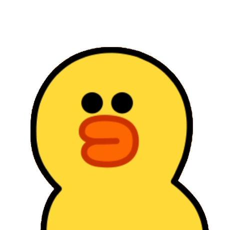
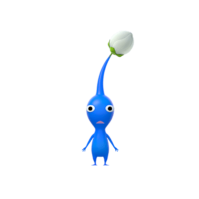

# 프로젝트 개요 및 기여한 점
# 🐶 Daengdong
반려동물과 함꼐 여행을 계획해 보세요!

## 💁‍♀️ Authors
<table>
  <tr>
         <td align="center" width="16%">
            <a href="https://github.com/jamm0316"></a>
            <br />
            <a href="https://github.com/jamm0316">송재명</a>
        </td>
         <td align="center" width="16%">
            <a href="https://github.com/kseenyoung"></a>
            <br />
            <a href="https://github.com/kseenyoung">김신영</a>
        </td>
         <td align="center" width="16%">
            <a href="https://github.com/dmlcksghd"></a>
            <br />
            <a href="https://github.com/dmlcksghd">홍의찬</a>
        </td>
         <td align="center" width="16%">
            <a href="https://github.com/minyoung0302"></a>
            <br />
            <a href="https://github.com/minyoung0302">정민영</a>
        </td>
         <td align="center" width="16%">
            <a href="https://github.com/yuseonghun"></a>
            <br />
            <a href="https://github.com/yuseonghun">유성훈</a>
        </td>
         <td align="center" width="16%">
            <a href="https://github.com/boseungdl"></a>
            <br />
            <a href="https://github.com/boseungdl">한승보</a>
        </td>
    </tr>
</table>

## ⚙️ Tech Stack

**Client:** Javascript, HTML, CSS

**Server:** Java, WebSocket, JSP

**Database:** MySQL 

## 🧱 Archetecture & Development Environment


`IDE` Intellij

`JDK` >= 11

`OS` mac, window

## 🔥 해결한 문제
### 1. WebSocket 세션 유실 문제를 해결하기 위해 세션 식별 구조 설계
#### 문제인식
- WebSocket 연결 시 사용자 세션 정보 미연동 현상 발생
- 채팅방 입장 시 세션 정보 부재로 참여자 등록 실패 → 메시지 전송 실패

#### 진단
- WebSocket은 **연결 상태를 유지하는 프로토콜**, 최초 HTTP Handshake 후 **HTTP 세션과 별개로 동작**
- 기존 인증 서버의 HTTP 세션 기반으로 작동, WebsSocket 연결 시 사용자 정보 함께 전달 못함
- 따라서, WebSocket 내에 사용자 정보 전달 구조 필요

#### 판단 및 해결 <br>
<br>

- **세션 연동 구조 설계**
  - [HttpSessionInterceptor](https://github.com/jamm0316/DaengDong/blob/main/src/main/java/com/shinhan/daengdong/chat/websocket/HttpSessionInterceptor.java)를 통해 최초 HandShake 시 HTTP 세션 ID 및 사용자 정보 추출 → WebSocketSession 매핑
- **세션-사용자 매핑 레이어 도입**
  - [WebSocketSessionManager](https://github.com/jamm0316/DaengDong/blob/main/src/main/java/com/shinhan/daengdong/chat/websocket/WebSocketSessionManager.java)로 세션 ID 기준 채팅방, 사용자 정보 매핑
- **접속 종료 처리 구조화**
  - 연결 해제 시, WebSocketSession 제거, 참여자 목록 자동 정리
- **역할 기반 모듈화 설계**
  - 인터셉터, 매니저, 핸들러를 분리하여 구조화 → 재사용성 및 유지보수성 향상

#### 성과
✅ **재접속 시 사용자 식별 정확도 100%, 유지 및 모듈화된 구조로 유지보수성 향상**
✅ **채팅방별 참여자 실시간 채팅 기능**


---

### 2. 실시간 채팅 내역 유지 이슈 해결 (WebSocket + Supabase 활용)
#### 문제인식
- 기존 시스템에 채팅 기능 미제공
- DB에 채팅 테이블 미존재 → 대화내용 저장 불가
- 채팅창을 다으면 메시지 사라짐  대화 흐름 단절 발생
- 개발이 상당히 진행된 상태 → DB 구조 변경은 비용 및 일정 지연 리스크 존재

#### 진단
- 채팅 내역 3가지 저장 방식에 대한 특징과 장단점 비교 분석<br>
  

  
#### 판단 및 해결
- 로컬/서버 저장 방식과 외부스토리지 방식 비교 후, 기존 DB 수정 없이 확장 가능한 외부 스토리지(Supabase) 채택
- Supabase를 활용해 채팅 메시지를 실시간 저장 및 조회 가능하도록 구현<br>
  


#### 성과
✅ **DB 구조 변경 없이도 채팅 내역 유지 기능을 안정적으로 구현하여 UX 불편 해소**<br>
  

---

### 3. Kakao Map API 한계를 극복한 썸네일 자동 로딩 개선(JSoup 크롤링)
#### 문제인식
- 사용자가 등록한 여행지 목록에 대표 이미지가 노출되지 않아 시각적 완성도와 정보성이 낮았음.

#### 진단
- Kakao Map API는 장소 상세이페이지 URL까지만 제공하며, 대표 이미지의 src 경로는 포함하지 않음.
- 따라서 웹 크롤링 없이 이미지를 가져올 수 없다는 기술적 제약 존재.

#### 판단 및 해결
- 상세페이지 URL의 패턴을 분석하고 place_id 기반의 URL 동적 생성.
- JSoup을 활용해 해당 URL의 HTML 구조를 분석, img 태그의 src 속성을 크롤링해 이미지 경로 획득.<br>
  

#### 성과
- ✅ **외부 API 제약을 자체 기술로 극복하여, 썸네일 자동 로딩으로 UX 완성도 향상**<br>
  

---

### 4. 사용자 요구 기반 기능 구현 우선순위 설정 (구글 폼 설문 활용)
#### 문제인식
- 기획 단계에서 어떤 기능이 우선되어야 할지 판단이 어려웠고, 사용자 관점에서 필요한 기능이 무엇인지 명확하지 않았음.

#### 진단
- 사용자 설문조사
  - 54명을 대상으로 한 설문조사 결과, 다수가 2인 이상 여행(85%)을 하며 여행 중 꿀팁(62.3%)을 중요하게 여김을 확인.<br>
    
    
- 실제 서비스 시장조사
  
  - 시장에서 서비스되고 있는 플랫폼의 경우 여행지 정보/예약 서비스만 제공
  - 여행 동선을 계획하고 이를 공유하는 서비스는 없음
  - 사용자끼리 꿀팁을 공유할 수 있는 서비스는 없음<br>
     

#### 판단 및 해결
- 여행 계획 및 공유 기능 UI/UX제안 및 설계<br>
  

- 커뮤니티 카테고리 UI/UX 제안 및 설계<br>
  

#### 성과
✅ **사용자 니즈 기반으로 기능 우선순위를 정하고 실시간 공유 및 정보 제공 기능을 설계, 구현하여 사용자 중심의 서비스 완성도 향상.**

<br>
<br>

# 프로젝트 상세 설명

## 스크린샷

### 여행기능


### 채팅기능


### 커뮤니티기능


### 회원가입


### 마이페이지 프로필


## 디렉토리 구조

### java
``` text
├── java
│   └── com
│       └── shinhan
│           └── daengdong
│               ├── chat
│               │   ├── controller
│               │   │   └── ChatController.java
│               │   ├── dto
│               │   │   └── ChatMessageDTO.java
│               │   ├── model
│               │   │   ├── ChatParticipant.java
│               │   │   ├── ChatRoom.java
│               │   │   ├── repository
│               │   │   │   └── ChatRoomRepository.java
│               │   │   └── service
│               │   │       └── ChatService.java
│               │   └── websocket
│               │       ├── ChatWebSocketConfig.java
│               │       ├── ChatWebSocketHandler.java
│               │       ├── HttpSessionInterceptor.java
│               │       ├── SessionInfo.java
│               │       └── WebSocketSessionManager.java
│               ├── home
│               │   └── controller
│               │       └── HomeController.java
│               ├── member
│               │   ├── controller
│               │   │   ├── MemberController.java
│               │   │   ├── MemberRestController.java
│               │   │   └── OauthController.java
│               │   ├── dto
│               │   │   ├── FavoritePlaceDTO.java
│               │   │   ├── FollowDTO.java
│               │   │   ├── ImageDTO.java
│               │   │   ├── LikePostsDTO.java
│               │   │   ├── MemberDTO.java
│               │   │   ├── NotificationDTO.java
│               │   │   ├── PetImageDTO.java
│               │   │   ├── RelationshipsDTO.java
│               │   │   └── SignUpDTO.java
│               │   ├── model
│               │   │   ├── repository
│               │   │   │   ├── MemberRepositoryImpl.java
│               │   │   │   └── MemberRepositoryInterface.java
│               │   │   └── service
│               │   │       ├── GoogleOauthService.java
│               │   │       ├── KakaoOauthService.java
│               │   │       ├── MemberServiceImpl.java
│               │   │       └── MemberServiceInterface.java
│               │   └── vo
│               │       ├── MemberPostsVO.java
│               │       └── MemberVO.java
│               ├── notification
│               │   ├── controller
│               │   ├── dto
│               │   ├── model
│               │   │   ├── repository
│               │   │   └── service
│               │   └── vo
│               ├── pet
│               │   └── dto
│               │       └── PetDTO.java
│               ├── photocard
│               │   ├── controller
│               │   ├── dto
│               │   ├── model
│               │   │   ├── repository
│               │   │   └── service
│               │   └── vo
│               ├── place
│               │   ├── controller
│               │   │   └── PlaceController.java
│               │   ├── dto
│               │   │   ├── FavoriteDTO.java
│               │   │   ├── PlaceDTO.java
│               │   │   ├── PlanPlaceDTO.java
│               │   │   └── RegionDTO.java
│               │   ├── model
│               │   │   ├── repository
│               │   │   │   ├── PlaceRepositoryImpl.java
│               │   │   │   └── PlaceRepositoryInterface.java
│               │   │   └── service
│               │   │       ├── PlaceServiceImpl.java
│               │   │       └── PlaceServiceInterface.java
│               │   └── vo
│               ├── plan
│               │   ├── controller
│               │   │   └── PlanController.java
│               │   ├── dto
│               │   │   ├── MemberPlanDTO.java
│               │   │   ├── PlanDTO.java
│               │   │   ├── PlanDetailsDTO.java
│               │   │   └── PlanRelationshipsDTO.java
│               │   ├── model
│               │   │   ├── repository
│               │   │   │   ├── PlanRepositoryImpl.java
│               │   │   │   └── PlanRepositoryInterface.java
│               │   │   └── service
│               │   │       ├── PlanServiceImpl.java
│               │   │       └── PlanServiceInterface.java
│               │   ├── vo
│               │   │   └── PlanVO.java
│               │   └── websoket
│               │       ├── PlanHandshakeInterceptor.java
│               │       └── PlanWebSocketHandler.java
│               ├── post
│               │   ├── controller
│               │   │   ├── PostController.java
│               │   │   └── PostRestController.java
│               │   ├── dto
│               │   │   ├── CommentDTO.java
│               │   │   ├── LikeDTO.java
│               │   │   ├── PostDTO.java
│               │   │   └── PostIMGDTO.java
│               │   ├── model
│               │   │   ├── repository
│               │   │   │   ├── PostRepositoryImpl.java
│               │   │   │   └── PostRepositoryInterface.java
│               │   │   └── service
│               │   │       ├── PostServiceImpl.java
│               │   │       └── PostServiceInterface.java
│               │   └── vo
│               │       ├── CommentVO.java
│               │       ├── LikeVO.java
│               │       └── PostVO.java
│               ├── review
│               │   └── dto
│               │       └── ReviewDTO.java
│               └── util
│                   ├── JacksonConfig.java
│                   ├── WebSocketConfig.java
│                   └── awsS3
│                       ├── S3Config.java
│                       ├── S3Controller.java
│                       └── S3Service.java
├── resources
│   ├── application.properties
│   ├── daengdong.sql
│   ├── dump.sql
│   ├── keystore.p12
│   ├── log4j.xml
│   └── mybatis
│       ├── mappers
│       │   ├── memberMapper.xml
│       │   ├── placeMapper.xml
│       │   ├── planMapper.xml
│       │   └── postMapper.xml
│       └── sqlMapConfig.xml
```

### webapp
``` text
├── WEB-INF
│   ├── root-context.xml
│   ├── root-contextDB.xml
│   ├── servlet-context.xml
│   ├── views
│   │   ├── chat
│   │   │   └── chatFragment.jsp
│   │   ├── common
│   │   │   └── header.jsp
│   │   ├── home.jsp
│   │   ├── member
│   │   │   ├── editNickName.jsp
│   │   │   ├── followerModal.jsp
│   │   │   ├── followingModal.jsp
│   │   │   ├── header.jsp
│   │   │   ├── login.jsp
│   │   │   ├── mypage.jsp
│   │   │   ├── petCreateProfileModal.jsp
│   │   │   ├── petProfileModal.jsp
│   │   │   ├── post.html
│   │   │   ├── profileFragment.jsp
│   │   │   ├── semiCategory
│   │   │   │   ├── photoCard.jsp
│   │   │   │   ├── save
│   │   │   │   │   ├── favoritePlaceFragment.jsp
│   │   │   │   │   ├── likePostsFragment.jsp
│   │   │   │   │   ├── myPostsFragment.jsp
│   │   │   │   │   ├── reviewFragment.jsp
│   │   │   │   │   └── reviewUpdateModal.jsp
│   │   │   │   ├── save.jsp
│   │   │   │   ├── trip
│   │   │   │   │   ├── completeTravelFragment.jsp
│   │   │   │   │   ├── planningFragment.jsp
│   │   │   │   │   └── travelingFragment.jsp
│   │   │   │   └── trip.jsp
│   │   │   ├── signUp.jsp
│   │   │   └── userProfileImageModal.jsp
│   │   ├── photocard
│   │   ├── place
│   │   │   └── searchPlace.jsp
│   │   ├── plan
│   │   │   ├── createPlan.jsp
│   │   │   ├── myPlace.jsp
│   │   │   └── newPlan.jsp
│   │   └── post
│   │       ├── post.jsp
│   │       ├── postCol.jsp
│   │       └── postDetail.jsp
│   └── web.xml
├── css
│   ├── chat
│   │   └── chat.css
│   ├── header.css
│   ├── member
│   │   ├── favoritePlace.css
│   │   ├── followModal.css
│   │   ├── likePosts.css
│   │   ├── login.css
│   │   ├── myPlan.css
│   │   ├── myPost.css
│   │   ├── mypage.css
│   │   └── reviews.css
│   ├── photoCard
│   ├── plan
│   │   ├── searchPlace.css
│   │   └── searchPlceImpl.css
│   ├── post
│   │   ├── post.css
│   │   └── postDetail.css
│   └── signUp.css
├── images
│   ├── banner.jpg
│   ├── community.png
│   ├── header_arlam.png
│   ├── header_community.png
│   ├── header_plan.png
│   ├── header_user.png
│   ├── image 16.png
│   ├── love.png
│   ├── modal.png
│   ├── one-svgrepo-com.svg
│   ├── plan.png
│   └── user.png
├── img
│   ├── Downloads
│   │   ├── day08
│   │   │   └── day08
│   │   │       ├── AbstractTest.java
│   │   │       ├── AppCDInfo.java
│   │   │       ├── Audio.java
│   │   │       ├── CDInfo.java
│   │   │       ├── Changeable.java
│   │   │       ├── Colorable.java
│   │   │       ├── EMailSender.java
│   │   │       ├── Inheritance.java
│   │   │       ├── InterfaceTest.java
│   │   │       ├── Lendable.java
│   │   │       ├── MessageSender.java
│   │   │       ├── Moveable.java
│   │   │       ├── MyBox.java
│   │   │       ├── MyInterface.java
│   │   │       ├── MyInterfaceImpl1.java
│   │   │       ├── MyInterfaceImpl2.java
│   │   │       ├── Prob1.java
│   │   │       ├── RemoteController.java
│   │   │       ├── RemoteController2.java
│   │   │       ├── Resizable.java
│   │   │       ├── SMSSender.java
│   │   │       ├── SeparateVolume.java
│   │   │       ├── Television.java
│   │   │       ├── TranformImpl.java
│   │   │       └── Transformable.java
│   │   ├── movie
│   │   │   └── movie
│   │   │       ├── movieController
│   │   │       │   ├── MovieController.java
│   │   │       │   ├── ReserveController.java
│   │   │       │   └── UserController.java
│   │   │       ├── movieDAO
│   │   │       │   ├── MovieDAO.java
│   │   │       │   ├── ReserveDAO.java
│   │   │       │   └── UserDAO.java
│   │   │       ├── movieDTO
│   │   │       │   ├── MovieDTO.java
│   │   │       │   ├── ReserveDTO.java
│   │   │       │   └── UserDTO.java
│   │   │       ├── movieService
│   │   │       │   ├── MovieService.java
│   │   │       │   ├── ReserveService.java
│   │   │       │   └── UserService.java
│   │   │       └── movieView
│   │   │           ├── MovieView.java
│   │   │           ├── ReserveView.java
│   │   │           └── UserView.java
│   │   ├── pet
│   │   │   ├── PretendardVariable.woff2
│   │   │   ├── images
│   │   │   │   ├── banner.jpg
│   │   │   │   ├── community.png
│   │   │   │   ├── image 16.png
│   │   │   │   ├── love.png
│   │   │   │   ├── one-svgrepo-com.svg
│   │   │   │   ├── plan.png
│   │   │   │   └── user.png
│   │   │   ├── main.css
│   │   │   ├── main2.html
│   │   │   ├── pet.code-workspace
│   │   │   ├── post.css
│   │   │   └── post.html
│   │   └── pro15
│   │       └── pro15
│   │           └── src
│   │               └── sec01
│   │                   ├── ex01
│   │                   │   └── FileUpload.java
│   │                   └── ex02
│   │                       └── FileDownload.java
│   ├── Like.png
│   ├── Likefull.png
│   ├── comment.png
│   ├── daengdong_dog.jpeg
│   ├── empty_like_icon.png
│   ├── empty_star.png
│   ├── fullLike.png
│   ├── kakao_login.png
│   ├── kseenyoungProfile.jpeg
│   ├── left-arrow.png
│   ├── login.png
│   ├── main2.png
│   ├── main3.png
│   ├── main4.png
│   ├── main5.png
│   ├── modal.png
│   ├── more.png
│   ├── plan_create.jpg
│   ├── plan_create2.jpg
│   ├── profile10.jpg
│   ├── profile7.jpg
│   ├── profile8.jpg
│   ├── profile9.jpg
│   ├── right-arrow.png
│   ├── shorlock.jpeg
│   └── star.png
├── index.jsp
├── js
│   ├── addCompanion.js
│   ├── chat
│   │   ├── chat.js
│   │   └── planChat.js
│   ├── finalSend.js
│   ├── main.js
│   ├── member
│   │   └── mypage.js
│   ├── photoCard
│   ├── planWebSocket.js
│   ├── post
│   │   ├── like.js
│   │   └── postImageUpload.js
│   ├── searchPlace_app.js
│   ├── signUp.js
│   ├── uploadFile.js
│   └── websocket.js
├── main2.jsp
├── style2.css
└── upload
    ├── cat1_1736831296666.jpg
    ├── cat2_1736831263308.jpg
    ├── cat3_1736831263307.jpg
    └── cat4_1736831263306.jpg
```
<!-- ## API Reference

### Auth

#### login page

```http
  GET /auth/login.do
```

#### login

```http
  POST /auth/login.do
```

| Parameter | Type     | Description                       |
| :-------- | :------- | :-------------------------------- |
| `member_id` | `string` | **Required**. Id of member |
| `password`  | `string` | **Required**. password of member |


### Room

#### room page

```http
  GET /room/rooms.do
```

### Chat

#### chat page

```http
  GET /chat/chat.do?chatId
```

| Parameter | Type     | Description                       |
| :-------- | :------- | :-------------------------------- |
| `chatId` | `int` | **Required**. chatId for enter chat |
-->

## Run Locally

project Clone

```bash
  git clone https://github.com/kseenyoung/DaengDong
```

Tomcat start
port:5555
context:daengdong

main url
```
http://localhost:5555/daengdong/
```

